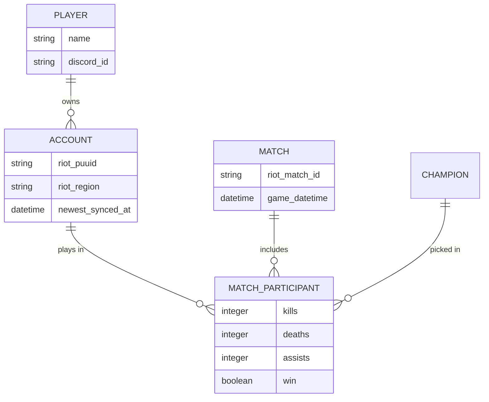
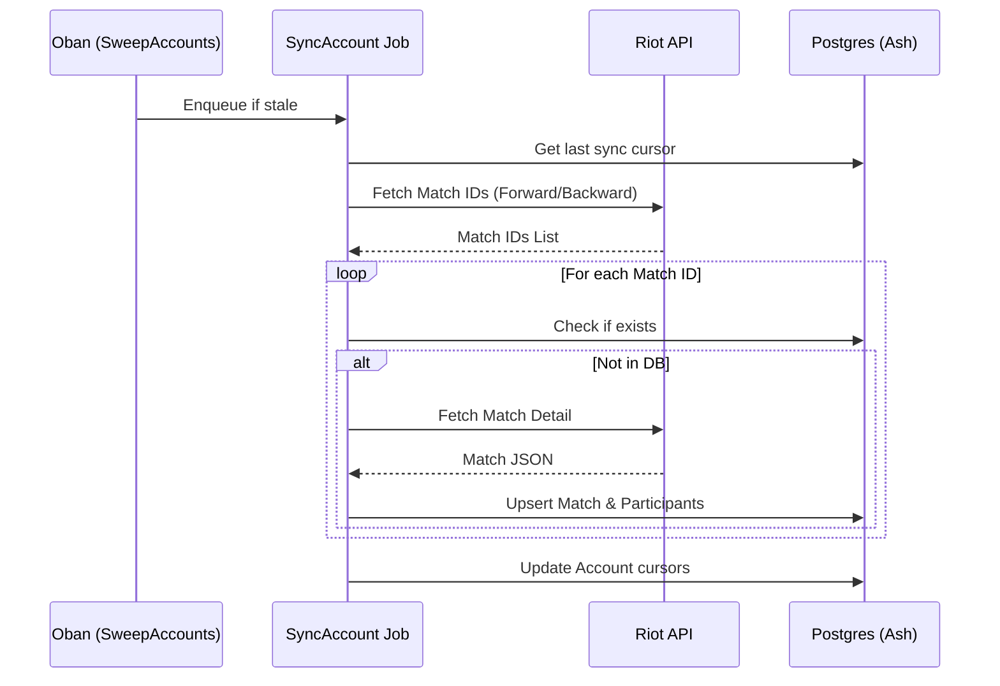

# Architecture

This document provides a deep dive into the technical architecture of the **Receipts** application.

## Overview

Receipts is built on the **Elixir** ecosystem, leveraging **Phoenix** for the web interface and **Ash Framework** for the domain layer. It follows a resource-oriented architecture where business logic is encapsulated within Ash resources and actions.

---

## Domain Model (Ash Framework)

The core domain is defined in the `Receipts.LoL` domain (see `lib/receipts/lol/lol.ex`).

### Key Resources

- **`Player`**: Represents a physical person (a friend).
  - Relationships: `has_many :accounts`.
  - Identity: Unique `discord_id`.
- **`Account`**: Represents a Riot Games account.
  - Relationships: `belongs_to :player`.
  - Fields: `riot_puuid`, `riot_game_name`, `riot_tag_line`, `riot_region`.
  - State: Tracks sync progress via `newest_synced_at`, `oldest_synced_start`, and `history_fully_synced`.
- **`Champion`**: Static data for League champions.
  - Fields: `riot_id`, `name`, `key`, `image`.
- **`Match`**: Global record of a game session.
  - Identity: Unique `riot_match_id`.
  - Fields: `game_datetime`, `queue_type`, `raw_info` (JSON blob).
- **`MatchParticipant`**: The join entity between `Account`, `Match`, and `Champion`.
  - Denormalization: Stores `game_datetime` and `queue_type` directly to enable efficient filtering and sorting without joining the `Match` table.
  - Fields: `kills`, `deaths`, `assists`, `win`, `position`, `items`, `raw_participant` (JSON blob).

---

## Data Synchronization

Data is fetched from the Riot Games API and cached in Postgres to provide fast, local queries.

### Caching Strategy

Each `Account` maintains two sync pointers:
1.  **Forward Sync**: Fetches matches newer than `newest_synced_at`. This runs frequently to keep the app up-to-date.
2.  **Backward Sync**: Pages backward through history from `oldest_synced_start` until `history_fully_synced` is reached. This is used for backfilling historical data.

### Background Workers (Oban)
- **`SweepAccounts`**: Runs periodically to find accounts that need syncing and enqueues `SyncAccount` jobs.
- **`SyncAccount`**: Performs the Riot API calls for a specific account.
- **`SyncDataDragon`**: Periodically updates the `Champion` resource from Riot's Data Dragon service.

---

## Querying Logic

Complex aggregations and comparisons are handled in `Receipts.LoL.Queries`.

### "Receipts" Aggregation
Aggregates `MatchParticipant` rows across **all accounts** for a given `Player` and `Champion`. It calculates:
- Overall win rate and games played.
- KDA (Kills, Deaths, Assists) averages and ratios.
- Position-specific performance (Top, Jungle, Mid, etc.).
- Recent game history.

### Comparison & Common Matches
The system can identify "common matches" where multiple selected players were in the same game. This is used for:
- **Group Win Rate**: Performance when the squad plays together.
- **Synergy Analysis**: How specific player/champion combinations perform together.

---

## AI Integration (Google Gemini)

AI is used to provide qualitative insights from quantitative data.

- **Client**: `Receipts.AI.Gemini` (a wrapper around `Req`).
- **Structured Output**: Uses Gemini's `responseSchema` to ensure the AI returns valid JSON matching the app's internal types.
- **Prompt Labs**: The `CompPromptLabLive` and `WinLossPromptLabLive` views allow admins to iterate on system instructions and prompt templates, comparing results across different "runs".

---

## Observability

- **Metrics**: `PromEx` exposes application and VM metrics at `/metrics`.
- **Dashboards**: Grafana dashboards (provisioned via Docker) visualize performance, error rates, and sync status.
- **Logs**: Structured logging is implemented via `Receipts.LoggerFormatter`, making logs easier to parse in Loki.

---

## Security

- **Admin Authentication**: A simple password-based session (configured via `ADMIN_PASSWORD`) protects sensitive views like Player management and Prompt Labs.
- **Signature Verification**: Discord webhook requests are verified using Ed25519 signatures (via `DISCORD_PUBLIC_KEY`).
