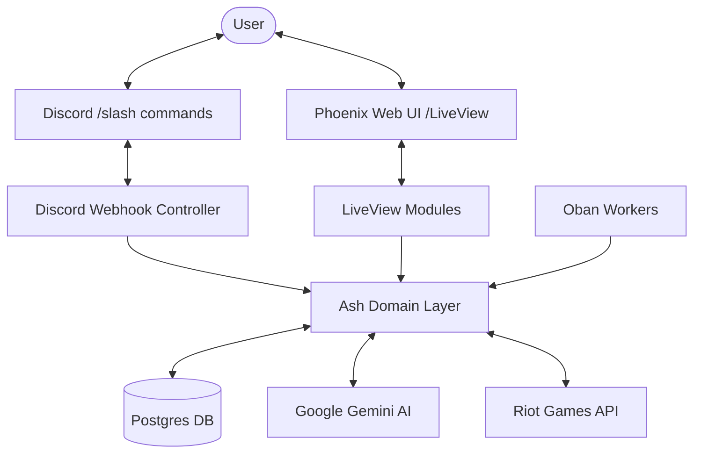

# Receipts

A League of Legends "receipts" app for a private friend group. When someone picks a champion in a game together, friends can call a Discord command to pull up that person's stats on that champion — proving (or disproving) that they actually know how to play it.

## What it does

- **Discord Slash Commands**: (e.g., `/receipts @friend Yasuo`) returns a summary of a player's performance on a given champion across all their League accounts.
- **Phoenix Web UI**: A modern interface for browsing the squad, comparing players, and local testing of queries.
- **AI-Powered Analysis**: Generates factual, compact recommendations and performance summaries using Google Gemini Flash.
- **Incremental Match Caching**: Efficiently fetches and stores match data from the Riot API into Postgres.
- **Prompt Labs**: Dedicated interfaces for tuning and testing AI prompts for composition suggestions and win/loss analysis.

## System Overview

## Directory Structure

- `lib/receipts/` - Core business logic and Ash domain resources.
  - `ai/` - Gemini API integration and structured prompting logic.
  - `lol/` - Ash resources (`Match`, `Player`, `Account`) and complex queries.
  - `riot/` - Riot Games API client and Data Dragon integration.
  - `workers/` - Oban background workers for incremental data syncing.
- `lib/receipts_web/` - Phoenix web interface.
  - `controllers/` - Traditional HTTP controllers (including Discord webhooks).
  - `live/` - LiveView pages for player stats, comparisons, and prompt labs.
  - `components/` - Reusable UI components and layouts.
- `deploy/` - Infrastructure configuration for production (Docker, Monitoring).
- `priv/repo/` - Database migrations and seeds.

## Architecture

### Tech Stack

- **Elixir 1.15+** & **Phoenix 1.8** with LiveView for the reactive web UI.
- **Ash Framework 3.0** for a declarative, resource-oriented domain layer.
- **Postgres** (via `ash_postgres`) as the primary data store.
- **Oban** (via `ash_oban`) for reliable background synchronization jobs.
- **Google Gemini** for structured AI insights.
- **PromEx** for exposing Telemetry metrics to Prometheus/Grafana.
- **Docker Compose** for local services and production deployment.

### Data Model (Ash Resources)

- **`Player`**: A friend in the group, linked to a Discord user ID.
- **`Account`**: A Riot account (PUUID, region, etc.) belonging to a Player. Manages sync cursors.
- **`Champion`**: Sync'd from Riot Data Dragon (name, key, image).
- **`Match`**: A game session, deduplicated by `riot_match_id`.
- **`MatchParticipant`**: Joins Account, Match, and Champion with normalized stats (KDA, win/loss, items, position).

### Riot API Caching

The system uses an incremental two-cursor sync per account:

1.  **Forward Cursor** (`newest_synced_at`): Keeps data fresh by fetching new matches.
2.  **Backward Cursor** (`oldest_synced_start`): Pages back through history until fully synced.
    An Oban cron job (`SweepAccounts`) ensures all accounts stay up to date.

## Local Development

### Setup

1.  Copy `.env.example` to `.env` and fill in your `RIOT_API_KEY` and other credentials.
2.  Install dependencies: `mix setup`.
3.  Start the development environment: `make dev`. This starts Postgres via Docker and the Phoenix server.

### Commands

| Command         | Description                                                     |
| :-------------- | :-------------------------------------------------------------- |
| `make dev`      | Start Postgres and the Phoenix server (`iex -S mix phx.server`) |
| `make db.setup` | Create and migrate the database                                 |
| `make db.reset` | Drop and recreate the database                                  |
| `mix precommit` | Run format, linting, and tests (recommended before pushing)     |
| `mix test`      | Run the test suite                                              |

## Deployment

The project is designed for deployment via Docker Compose.

- **`deploy/`**: Contains configuration for Prometheus, Grafana, Loki, and Promtail.
- **Monitoring**: Real-time metrics and logging are baked in.
- **`make deploy`**: Syncs the local checkout and deploys to the configured home server.

---

## Technical Guidelines

### Elixir & Phoenix

- **Standard Library**: Prefer built-in `Time`, `Date`, and `DateTime` modules.
- **Concurrent Stream**: Use `Task.async_stream/3` for concurrent enumeration with back-pressure.
- **Layouts**: Always wrap LiveView templates with `<Layouts.app flash={@flash} ...>`.
- **Components**: Use `<.icon>`, `<.input>`, and `<.form>` from `CoreComponents`.
- **LiveView Streams**: Use streams for large collections to optimize memory usage.

### Ash Framework

- Use **Ash resources** for all domain logic and data access.
- Ensure proper associations and preloads are defined for efficient querying.

### JS & CSS

- **Tailwind CSS**: Use Tailwind classes for styling. Tailwind v4 is used (no `tailwind.config.js`).
- **Hooks**: Use colocated JS hooks (`:type={Phoenix.LiveView.ColocatedHook}`) for template-specific logic.

### Testing

- Use `start_supervised!/1` for process cleanup.
- Test against DOM IDs and structural outcomes rather than transient text content.
- Utilize `LazyHTML` for debugging complex selectors.
